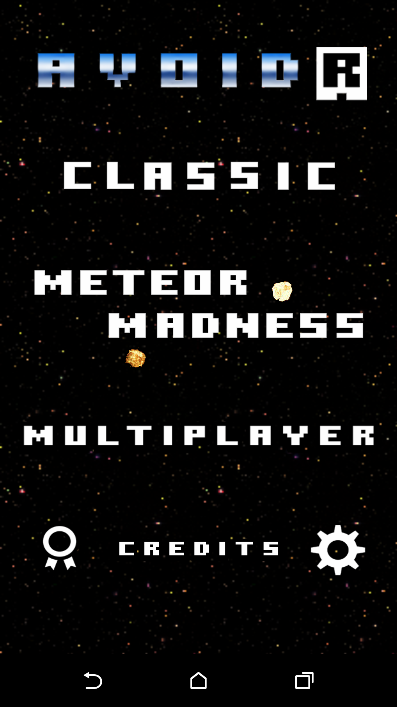
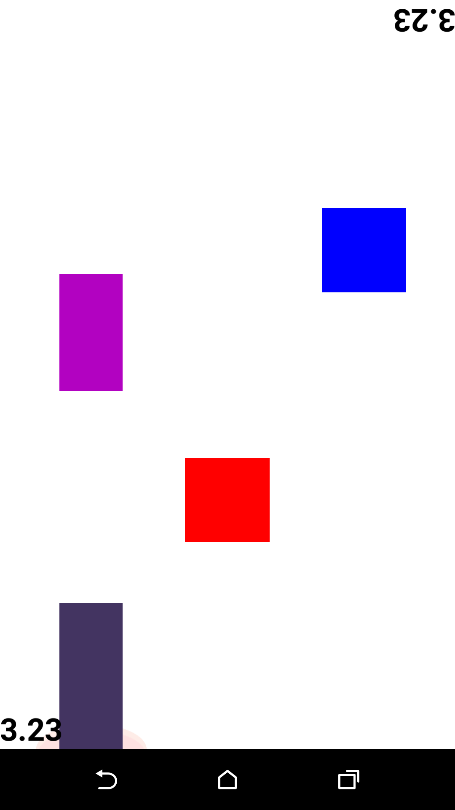
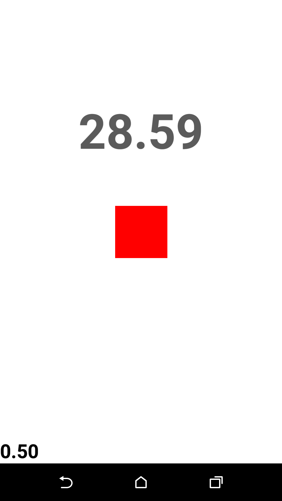
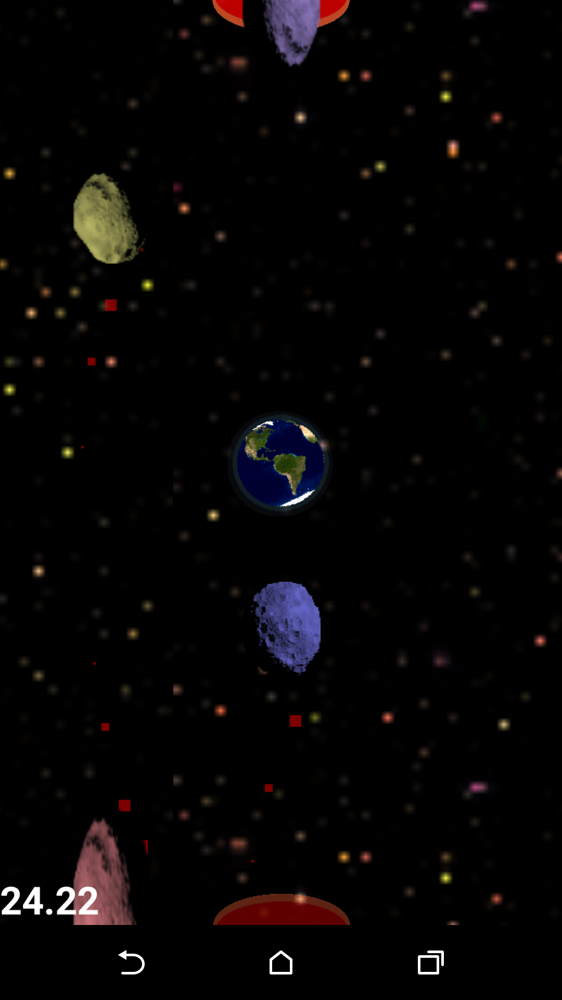

# Avoidr

Phone game made using the Corona SDK. Code by Elias Kassell Raymond and design by Raimonds Baukerts. This app was previously hosted on the Android Play Store, but has now been taken down. This means I can post the code open source without allowing people to take advantage of that by posting fake high scores.

The latest published build is available in the builds folder.

## Concept
The player has two controls: swipe left or swipe right. These are used to dodge incoming "notes". These notes play a sound when spawned indicating their spawn position, and increase in speed over time.

## Code Architecture
### main.lua
The main entry point for any Corona SDK app. Goes to nickname if one has not yet set, otherwise goes straight to mainmenu.lua

### nickname.lua
The first screen the user is greeted by when starting the app. The nickname they enter is stored locally and used whenever high scores are posted.

### mainmenu.lua
Allows the used to select which game mode they wish to play; classic, meteor madness or multiplayer. It also allows them to see high scores or change their settings.
#### highscores.lua
Retries and shows high scores. Users set high scores automatically during gameplay. Communication with the network is done with a REST architecture to a server hosted by https://backendless.com/. This allows simple but effective communication to allow users to post their high scores.
#### credits.lua
Credits screen available by clicking the avoidr logo at the top of the main menu.
#### settings.lua
Settings screen available on menu.

### ingame.lua
Used for all game modes, taking in input and moving the player as well as triggering new events.
#### stages.lua
Handles spawning of notes, speed of the game, text and special effects.
#### explosions.lua
Class holder just for explosions.

## Additional code
### fbtable.lua
My custom implementation for Facebook networking, used on other apps. Not used here.

## Screenshots
 
 

